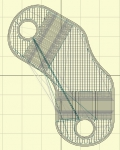
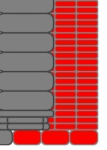
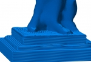
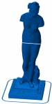
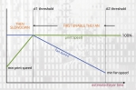
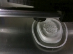

Slic3r was born in late 2011 as an attempt to modernize the 3D printing toolchain. It simplified slicing by **reducing configuration to just three options** (nozzle diameter, filament diameter, temperature) and it also made slicing a lot **faster** - but speed wasn't the main goal. The goal was to have clean, structured code for prototyping new features and getting a powerful slicing engine. This is why Slic3r uses **C++** code for the hardcore geometric processing, while it keeps higher-level logic in a flexible language such as **Perl**. Of course, more features mean longer processing times. As always, it comes down to a compromise!

I'll try to list some of the things that Slic3r introduced in 3D printing as original features.

  
First off, Slic3r was designed to expose a **full command line interface**. All options are available on the command line, and batch jobs can be performed through it. This is to avoid reinventing the wheel and let other projects focus on nice graphical interfaces, 3D visualization, G-code preview, print control. Slic3r can be easily integrated everywhere.

The first big change introduced by Slic3r was the **automatic detection of bridges**. Skeinforge couldn't do multiple bridges in a single layer, as it just made solid infill span the entire layer, resulting in a waste of material and suboptimal bridging direction. Slic3r detects each bridge independently and only extend it by the distance strictly needed for anchoring. (The same logic is applied to top surfaces, where solid infill is only extended where needed instead of the entire layer.)

A well-known feature introduced by Slic3r is **Microlayering** (aka _Infill every 'n' layers_, aka _Combine infill_). With this option, a different layer height is used for infill and for perimeters: this way you can do, say, 0.1mm thick perimeters while still printing infill at 0.3mm. You save time while still getting high resolutions on the surfaces. Note that this is very different from the "Skin" option that was introduced in Skeinforge: that one just duplicated perimeters several times, so you'd still get the infill resolution even on the outside. A former microlayering concept and implementation was actually introduced by Adrian Bowyer, so this is not entirely new in Slic3r.

Speaking of multiple layer heights, Slic3r introduced the ability to **assign different layer heights to different regions** of a single print. This allows to save time while still using thin layers for parts that need accuracy, and for example to have a thicker first layer for easier adhesion to print bed. Such a feature required a large refactoring of the codebase so that no algorithm relies on the assumption that all layers have the same thickness.

**Brim** is one more popular feature. It was actually proposed by the community as an effective way to improve adhesion and avoid warping.

Slic3r's **cooling logic** was also innovative: it controls both cooling fan and print speed in a single integrated logic. Triffid Hunter (Michael Moon), active member of the RepRap community, proposed it.

**Sequential printing** is one more popular feature, enabling users to compose plates of objects but have the printer print one object completely at time. This reduces the impact of a failure, since some objects would be completed.

The **Avoid crossing perimeters** feature, which took a few months to be completed, bends travel moves so that they don't cross objects when not strictly needed - and when it's needed, it tries to cross a vertex rather than a flat surface. This allows to get clean prints even with Bowden extruders (more prone to oozing). Skeinforge had a feature named 'comb' which served the same purpose, but it was very different as it actually walked over perimeters (while Slic3r stays far from perimeters, either on the inside or on the outside) and it followed them even in concave points until it reached the destination (while Slic3r just bends the path). Slic3r's implementation is based on visibility graphs and a weighted Dijkstra search.

One unique feature of Slic3r is the configuration of **different extrusion widths** for each print part (perimeters, infill, support, first layer etc.). This allows fine-grained tuning of the results and it makes the internals very complicated (and a bit slower, like all these features!) since no assumption can be made on widths.

One more unique feature of Slic3r is known as **Extra Perimeters**: this logic automatically increases the number of perimeters in those layers where slopes would expose some of the infill producing suboptimal results. (picture by Michael Andresen)

Slic3r also introduced true, complete, support for **multiple extruders**. While the previous solution was just to slice each material as a separate object and stitch the G-code files afterwards, Slic3r has native support for multimaterial files. It was one of the first applications able to read and write AMF files. It also allowed to use a **secondary extruder for support material**, opening the way to soluble support.

One less known option is **Only Infill Where Needed**: it will detect what upper parts of the object actually require infill for supporting the ceiling. For example, a dome only needs the central part supported: think of it like an internal support material. This saves time and material.

Another original feature is the ability to specify a **different number of top and bottom layers**. This allows, for example, to make vases from solid objects.

There are more less known features. One is **Acceleration control**: Slic3r allows to fine-tune your firmware by assigning different acceleration limits to each part of the print (perimeters, infill, bridges). This is for expert users, though!

Finally, Slic3r introduced an automatic logic for generating **internal bridges over sparse infill**. This greatly improves the quality of top surfaces. There's no option for this: Slic3r does it automatically for you :-)
