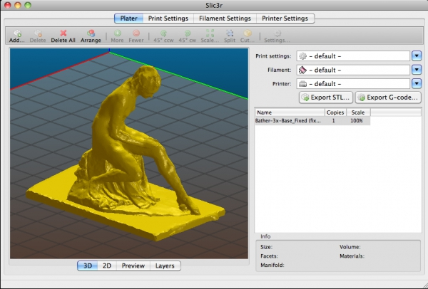
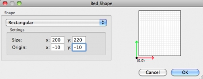
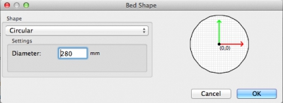
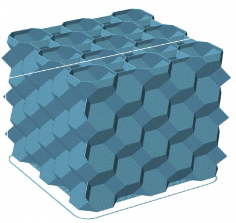
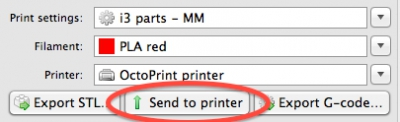
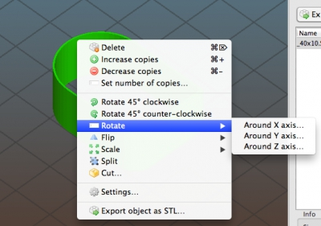

After 10 months of work we're proud to announce a new Slic3r stable release.

The Slic3r project was born in 2011 within the RepRap community as an effort to provide the growing 3D printing technology with an **open and flexible toolchain**. Slic3r, being a true **non-profit community project**, allowed the community to experiment with several **original new features** that have become common thereafter such as **multiple extruders**, **brim**, **microlayering**, **bridge detection**, **command line slicing**, **variable layer heights**, **sequential printing** (one object at time), **honeycomb infill**, **mesh cutting**, **object splitting into parts**, **AMF support**, avoid crossing perimeters, distinct extrusion widths, and much more. All of these features were first introduced in Slic3r and are now part of the commercial software out there.

Slic3r is based on a community of people working collaboratively on [GitHub](https://github.com/slic3r/Slic3r), discussing new features and testing them. It's being used by thousands of people all over the world, and there are more than 500 forks of it. It's a **non-profit project**. 3D printing became a business since the RepRap community was born, but **we want to keep 3D printing free**, and Slic3r will always be an **independent project**, not driven by any business or single vendor.

Oh, and **we don't like marketing buzzwords**. We'll not say *"the most advanced"*, *"the mostly used"*, *"the most professional"* software, although most people think that. (Some companies are advertising that their slicers now finally have honeycomb infill or material presets... in 2015? Come on, Slic3r introduced those a few years ago... ;-)) Let's not reinvent the wheel. Jump in and let's **collaborate** to push the technology forward.

This post summarizes some of the improvements since the old stable (1.1.7). Full release notes can be found in the [1.2.9 release page](/releases/1.2.9) and in the previous ones.** **

## Incremental real-time slicing

When you change a setting, slicing doesn't restart from scratch but only recalculates the affected parts. Also, when repositioning objects in plater or changing most options no recalculation is needed at all.

## 3D preview (with toolpaths)

A few nice OpenGL views were added: now we have **2D/3D plater** as well as **2D/3D toolpath preview**. The 3D toolpaths preview is very accurate, as it renders extrusion widths and extrusion heights correctly: G-code based preview tools are not able to do this because G-code does not carry that information.

## Customizable bed shape

**Rectangular**, **circular** or **completely custom** bed shapes can be configured using a **graphical wizard**.

## 3D Honeycomb infill

Thanks to David Eccles (gringer) we now have the first infill pattern that varies across Z instead of repeating the same shape in all layers.

## Integration with OctoPrint

Slice and upload to [OctoPrint](http://octoprint.org/) with a single click directly from Slic3r: this is a handy workflow for people using Slic3r together with the popular web-based print server. Configuration is very easy thanks to the Bonjour autodiscovery.

## Rotate/mirror/scale/flip

Thanks to a contextual menu, objects can be manipulated in all axes (X/Y/Z) before slicing or before exporting the transformed object. Slic3r is now a handy graphical tool for manipulating STL files.

## XY Size Compensation option

In order to **fight dimensional issues**, a new option was added like in most CNC/CAM applications. If you find a dimensional error in a printed object, just measure the error and put the negative value in this option: Slic3r will compensate for it. For more information, please [read this manual page](http://manual.slic3r.org/troubleshooting/dimension-errors).

## Many more advanced options

Advanced users have much more control over their prints thanks to several new tunable options, including extruders for support material and interface support material, contact distance between support material and object, infill/perimeters overlap.

## Autospeed

This is an experimental feature that, as often happened in the past, Slic3r is introducing in the 3D printing world. The purpose of this feature is to **keep volumetric speed constant** (thus, **nozzle pressure** too) throughout the print. The sudden pressure changes during the print, which are caused by print speed changes and by different extrusion widths (we like to use thin widths for external perimeters but fat infill, for example) often cause visible quality drop because there's a delay. This problem is very visible in printers having a Bowden extruder or when using soft filaments. Several strategies were tried in the past, including the advance algorithm in several firmware projects, and even a Pressure Regulation feature in Slic3r itself. But this new autospeed feature uses a different approach: it chooses the head speed automatically in order to keep volumetric speed constant. This will cause no pressure change inside the extruder, thus no delay.

Help testing and provide feedback!

