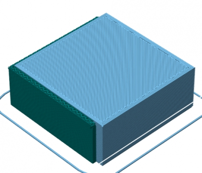

This is an experimental release. Help us testing!

For the full list of new features see also the [release notes for 1.1.0](/releases/1.1.0).  
Thanks to Petr Ledvinap and Y. Sapir for their contributions (optimization, patches for bridges, code review).

#### New features:

*   Ability to **cut models in two with a slicing plane** (resulting parts can be also exported)
*   Support material is automatically **excluded below successful bridges** and only added where strictly needed in order to **make anchors for potential bridges**; this results in much lighter support material for parts having flat overhanging areas

#### Improvements:

*   Support material **distance from object was reduced** and made more consistent
*   A base flange is added below pillars support material in order to connect them on the build plate
*   Spiral vase mode is prevented automatically for multi-island layers ([#1938](https://github.com/alexrj/Slic3r/issues/1938))

#### Bug fixes:

*   Fixed an upstream bug in the Clipper library causing some random perimeter segments to be swapped in order ([#1834](https://github.com/alexrj/Slic3r/issues/1834))
*   Bridge detection was choosing bad orientation in some cases
*   Sometimes islands were not completed fully before moving onto the next one ([#1137](https://github.com/alexrj/Slic3r/issues/1137))
*   Gap fill was not inserted in the corrected order before leaving an island ([#1907](https://github.com/alexrj/Slic3r/issues/1907))
*   A regression caused the _Default Extrusion Width_ option to be ignored ([#1958](https://github.com/alexrj/Slic3r/issues/1958))
*   The _[timestamp]_ placeholder in filename was not updated at every single job ([#1957](https://github.com/alexrj/Slic3r/issues/1957) [#1995](https://github.com/alexrj/Slic3r/issues/1995))
*   A regression caused bad loading of multi-extruder values in GUI ([#1984](https://github.com/alexrj/Slic3r/issues/1984))
*   Fixed regression and ambiguity about multi-value placeholders like _[first_layer_temperature_1]_ ([#1899](https://github.com/alexrj/Slic3r/issues/1899))
*   Fixed regression causing random lack of hole perimeters on Windows ([#1950](https://github.com/alexrj/Slic3r/issues/1950))
*   Fixed random crash when closing the Object Settings window

**The new cutting feature**:  

**New smart support material, only added where needed for making potential bridges:**  

