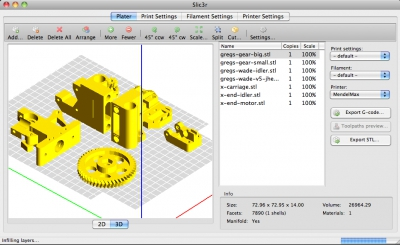
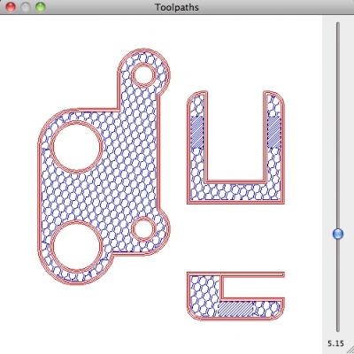
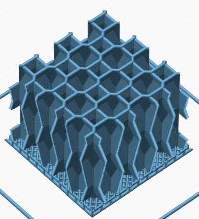

#### New features:

*   **Incremental real-time slicing**: when you change a setting, slicing doesn't restart from scratch but only recalculates the affected parts. Also, when repositioning objects in plater or changing most options no recalculation is needed at all
*   **Toolpaths preview**
*   **3D preview of plater**
*   **Customizable bed shape** (rectangular, circular, or completely custom)
*   New **3D honeycomb** fill pattern (credits to David Eccles/gringer for his research work, [#1646](https://github.com/alexrj/Slic3r/issues/1646))
*   **Rotate/mirror/scale** around X,Y,Z
*   New **XY Size Compensation** option for handling dimensional tolerance
*   Separate **extrusion width setting for external perimeters** (defaults to a thin extrusion for better quality, while internal loops use a thicker extrusion for better adhesion)
*   Contextual menu when right-clicking an item in plater
*   New --split command line option

#### Improvements:

*   _Avoid crossing perimeters_ is now much faster (but more work is planned on it)
*   Option controls are enabled/disabled dynamically according to their dependency from others
*   Perimeters of adjacent volumes having the same settings are merged
*   Skirt is printed outside brim to prevent conflicts ([#2157](https://github.com/alexrj/Slic3r/issues/2157))
*   Removed duplicated M204 commands ([#2183](https://github.com/alexrj/Slic3r/issues/2183))

#### Changes:

*   A minor change was applied in flow math that should reduce thickness of external perimeters by 0.02-0.06mm thus reducing dimensional issues for holes
*   The _"Combine STL files into multi-material AMF file"_ command was removed since the new Object Settings dialog provides a more flexible and interactive way for loading multi-part objects
*   Collision checks are relaxed when _Detect thin walls_ is disabled, for faster processing

#### Bugfix:

*   Some locale issues were arising when loading config files

* * *

#### 3D plater:

#### Toolpaths preview:

#### Bed shape customization:

#### 3D honeycomb infill:

#### Contextual menu:

#### Cutting plane:

