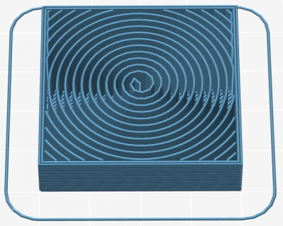

Thanks for the massive amount of feedback about all the new features in [1.2.0](/releases/1.2.0) (see [release notes](/releases/1.2.0) for the full list)!  
This release contains improvements and bug fixes. Help us testing it in order to make it stable.

#### New features:

*   Objects can be **selected and moved in the 3D view**
*   New experimental feature for **Pressure Management** based on the advance algorithm ([#1203](https://github.com/alexrj/Slic3r/issues/1203) [#1677](https://github.com/alexrj/Slic3r/issues/1677) [#2018](https://github.com/alexrj/Slic3r/pull/2018))
*   New Solid Infill Extruder option for selecting the extruder to be used for solid infill ([#618](https://github.com/alexrj/Slic3r/issues/618))
*   Support Material interface layers are now generated also above the object's top surfaces where support material, so that they can be printed with the interface extruder. ([#1939](https://github.com/alexrj/Slic3r/issues/1939))

#### Improvements:

*   Several **toolpaths and travel moves were optimized** in order to **reduce printing time**.
*   When a preset has unsaved changes, Slic3r now lists the changed options to the user.
*   The Toolpaths Preview window was moved into the main window instead of the separate modal dialog.
*   Slic3r now remembers size and position of the main window.
*   The Hilbert Curve, Archimedean Chords and Octagram Spiral infill patterns are now centered around object's center and they are not cross-hatched anymore in order to get a nicer effect.
*   Several code parts were refactored.
*   More user-friendly behavior of the _Spiral Vase_ option checkbox: it now prompts the user whenever other options needs to be adjusted for it to work. Also, the command line --spiral-vase flag now overrides --perimeters, --top-solid-layers, --fill-density instead of throwing an incompatibility error. ([#2360](https://github.com/alexrj/Slic3r/issues/2360))
*   The layout of the plater panel was slightly changed in order to have larger selectors for presets (long preset names were truncated on Windows).
*   Configuration validation errors are now shown in the status bar when background processing failed.
*   When _Only retract when crossing perimeters_ is enabled, retraction is now triggered also when crossing boundaries of adjacent regions. ([#2298](https://github.com/alexrj/Slic3r/issues/2298))
*   Original object slice contours are displayed in overlay in the Toolpaths Preview.
*   The Wipe feature does not generate wiping moves after layer change anymore. ([#2214](https://github.com/alexrj/Slic3r/issues/2214))

#### Changes:

*   _--solid-fill-pattern_ was renamed to _--external-fill-pattern_ in order to reflect its effect better.
*   Brim is now printed using the extruder configured for perimeters.

#### Bugfix:

*   When _Lift on retraction_ was enabled and Z offset contained a value that was greater than the amount of the lift, an initial move was generated that pushed the extruder below the configured Z offset ([#2349](https://github.com/alexrj/Slic3r/issues/2349))
*   Skirt and brim were not recalculated in background when objects were simply moved in the plater
*   Proper Unicode handling in file names and paths
*   _Spiral Vase_ did not work when the extrusion axis was not E. ([#2350](https://github.com/alexrj/Slic3r/issues/2350))
*   Fixed regression causing _Small Perimeters Speed_ not to be applied ([#2365](https://github.com/alexrj/Slic3r/issues/2365))
*   Fixed regression causing retraction to be skipped when _Retract Lenght_ was 0 but _Use Firmware Retraction_ was enabled. ([#2359](https://github.com/alexrj/Slic3r/issues/2359))
*   Fixed regression causing crashes when using _Avoid crossing perimeters_ under some circumstances.
*   Background recalculation was performed partially when _First Layer Extrusion Width_ was changed. ([#2379](https://github.com/alexrj/Slic3r/issues/2379))
*   Fixed regression in the Split feature ([#2380](https://github.com/alexrj/Slic3r/issues/2380))
*   Infill was not correctly generated when microlayering (_Combine infill every 'n' layers_) was used along with _Raft Layers_. ([#2396](https://github.com/alexrj/Slic3r/issues/2396))
*   Objects were not aligned to Z = 0 before STL export. ([#2393](https://github.com/alexrj/Slic3r/issues/2393))
*   Fixed crashes and/or deadlocks caused by background processing ([#2394](https://github.com/alexrj/Slic3r/issues/2394))
*   Infill pattern combobox was blank after selection on Windows. ([#2361](https://github.com/alexrj/Slic3r/issues/2361))
*   Avoid crossing perimeters generated useless moves during brim printing. ([#2412](https://github.com/alexrj/Slic3r/issues/2412))
*   Skirt flow was not properly adjusted when printing multiple skirt layers with different layer heights. ([#2307](https://github.com/alexrj/Slic3r/issues/2307))
*   Bed center was not honored in Quick Slice ([#2440](https://github.com/alexrj/Slic3r/issues/2440))
*   The Hilbert Curve, Archimedean Chords and Octagram Spiral infill patterns did not cover the entire infill area sometimes. ([#863](https://github.com/alexrj/Slic3r/issues/863) [#1162](https://github.com/alexrj/Slic3r/issues/1162))
*   Perimeters were extruded in the wrong order under some circumstances when _Detect overhangs_ was enabled and bridges were detected ([#2258](https://github.com/alexrj/Slic3r/issues/2258))
*   The Bed Shape dialog didn't retain the origin coordinates under some circumstances. ([#2427](https://github.com/alexrj/Slic3r/issues/2427))

* * *

This is how the Hilbert Curve, Archimedean Chords and Octagram Spiral infill patterns look like after the changes in this release:

