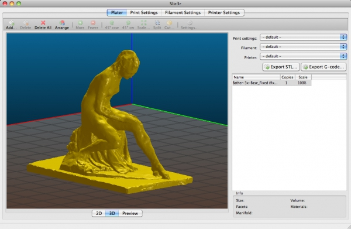

More bugfixes. We want to make 1.2.x stable soon.

For the whole list of changes and new features see the release notes for [1.2.0](/releases/1.2.0), [1.2.1](/releases/1.2.1), [1.2.2](/releases/1.2.2) and [1.2.3](/releases/1.2.3).

#### New features:

*   New option for generating **volumetric E values**. ([#1746](https://github.com/alexrj/Slic3r/issues/1746))
*   Each object in the plater can be **exported individually** by using a new "Export STL" command in its own contextual menu (right-click). ([#2479](https://github.com/alexrj/Slic3r/issues/2479))
*   A button was added to **test OctoPrint connectivity** on the fly. ([#2509](https://github.com/alexrj/Slic3r/issues/2509))

#### Improvements:

*   **3D view** has nicer **color and lighting scheme**, and nicer details. It also uses less memory.
*   The **motion planner** that generates smart travel moves when Avoid crossing perimeters was improved in order to support many cases that were previously not handled. It also generates more straight paths.
*   Perimeter speed for **nested islands** are now supported properly.
*   The logic for travel moves/retractions/motion planning was rewritten in order to handle several edge cases that weren't handled optimally.

#### Changes:

*   The _Vibration Limit_ option is now marked as deprecated. ([#2483](https://github.com/alexrj/Slic3r/issues/2483))
*   Mouse wheel zooming direction is now reversed. ([#2478](https://github.com/alexrj/Slic3r/issues/2478))

#### Bugfix:

*   Fixed a timeout issue with OctoPrint upload. ([#2481](https://github.com/alexrj/Slic3r/issues/2481))
*   Fixed an issue causing some gap fill to be omitted in rare cases. ([#2474](https://github.com/alexrj/Slic3r/issues/2474))
*   Fixed an issue in admesh code preventing some rare binary STL files from being parsed correctly on Windows. ([#2461](https://github.com/alexrj/Slic3r/issues/2461))
*   Fixed an issue causing random loss of perimeter segments in rare circumstances ([#2495](https://github.com/alexrj/Slic3r/issues/2495))
*   Fixed artifacts being introduced in model when regenerating perimeters multiple times via incremental slicing ([#2494](https://github.com/alexrj/Slic3r/issues/2494))
*   Fixed an issue in the newly introduced pressure regulation feature causing too much retractions and lack of discharge at the end of the print. ([#2470](https://github.com/alexrj/Slic3r/issues/2470))
*   Fixed minor glitches in 3D view ([#2482](https://github.com/alexrj/Slic3r/issues/2482) [#2454](https://github.com/alexrj/Slic3r/issues/2454))
*   Fixed validation for sequential printing being too strict in some cases ([#2480](https://github.com/alexrj/Slic3r/issues/2480))
*   Fixed inwards move at loop end being still generated outwards in some rare circumstances ([#2253](https://github.com/alexrj/Slic3r/issues/2253))
*   Fixed the About dialog being too small on Windows ([#2476](https://github.com/alexrj/Slic3r/issues/2476))
*   Fixed ground alignment of exported STL files after XY rotation/flipping ([#2512](https://github.com/alexrj/Slic3r/issues/2512))

* * *

